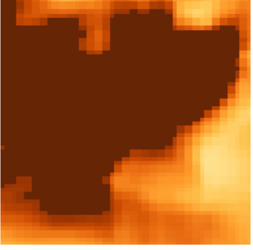

# 🌍 Threshold - Urban Development & Service Gap Analysis Platform

**Threshold** is a comprehensive geospatial analysis platform that combines satellite remote sensing, machine learning, and real-time data processing to identify optimal locations for urban development and analyze service accessibility gaps. Built for the NASA Space Apps Challenge, this platform empowers urban planners with data-driven insights for sustainable city development.

## 🎯 Project Overview

Threshold addresses critical urban planning challenges by providing:

- **🏠 Housing Development Hotspots**: Identifies prime vacant land suitable for residential development
- **🏥 Service Gap Analysis**: Analyzes accessibility to essential services (healthcare, parks, food, transport)
- **🌡️ Environmental Monitoring**: Real-time satellite data visualization for LST, NDVI, and air quality
- **🤖 ML-Powered Scoring**: Custom machine learning model for hotspot prediction
- **📊 Real-time Analytics**: Live data processing and visualization

---

## AQI Calculation
### PM 2.5 + PM 10+ NO2 + SO2 + CO = AQI
<br />
### AQI = [(Ihigh − Ilow) / (Chigh − Clow)] × (C − Clow) + Ilow

## 🏗️ System Architecture

### Architecture Diagrams/ Process Flow
<tr>
    <td></td>
    <td></td>
  </tr>

### Application Screenshots

<table>
  <tr>
    <td></td>
    <td></td>
  </tr>
  <tr>
    <td></td>
    <td></td>
  </tr>
  <tr>
    <td></td>
    <td></td>
  </tr>
  <tr>
    <td></td>
    <td></td>
  </tr>
</table>

<div align="center">
  
</div>

---

## 🛰️ Satellite Data & Remote Sensing

### ESA WorldCover Dataset
- **Dataset**: ESA WorldCover v200 (2021)
- **Resolution**: 10 meters
- **Coverage**: Global land cover mapping
- **Platform**: Sentinel-1 and Sentinel-2 satellites
- **Processing**: Google Earth Engine integration
- **Land Cover Classes**: 11 classes (Tree cover, Shrubland, Grassland, Cropland, Built-up, **Bare/sparse vegetation**, Snow/ice, Water bodies, Wetland, Mangroves, Moss/lichen)
- **Primary Focus**: Class 60 (Bare/sparse vegetation) for vacant land detection

### NASA GIBS Satellite Layers

#### 🌡️ Land Surface Temperature (LST)
- **Satellite**: MODIS Terra
- **Dataset**: `MODIS_Terra_Land_Surface_Temp_Day`
- **Resolution**: 1 km (GoogleMapsCompatible_Level7)
- **Temporal**: Daily
- **Usage**: Heat island analysis, climate monitoring

#### 🌱 Normalized Difference Vegetation Index (NDVI)
- **Satellite**: MODIS Terra  
- **Dataset**: `MODIS_Terra_NDVI_8Day`
- **Resolution**: 250m (GoogleMapsCompatible_Level9)
- **Temporal**: 8-day composite
- **Usage**: Vegetation health, urban green space analysis

#### 🌫️ Air Quality Layers
- **Carbon Monoxide**: AIRS L3 (500hPa, 2km resolution)
- **Aerosol Optical Depth**: MODIS Aqua (3km resolution)
- **Ozone**: OMI Total Column (Level 6)
- **Nitrogen Dioxide**: OMI Tropospheric Column (Level 6)
- **Sulfur Dioxide**: OMI Planetary Boundary Layer (Level 6)
- **PM2.5/PM10**: MERRA2 Dust Surface Mass Concentration (Monthly)

---

## 🤖 Machine Learning & Custom Dataset

### Custom Hotspot Scoring Dataset
Our platform features a **unique, synthetic dataset** specifically designed for urban hotspot analysis:

#### Dataset Specifications
- **Size**: 15,000 samples
- **Features**: 8 input variables
- **Target**: Hotspot Score (0.0 - 1.0)
- **Generation**: Sophisticated correlation modeling based on real urban planning principles

#### Input Features
1. **AQI** (Air Quality Index): 0-500 scale
2. **Population Density**: People per km²
3. **Distance to Hospital**: km
4. **Distance to School**: km  
5. **Distance to Airport**: km
6. **Distance to Bus Station**: km
7. **Distance to Railway**: km
8. **Distance to Mall**: km

#### Advanced Scoring Algorithm
```python
# Sophisticated scoring with area type correlation
def calculate_advanced_hotspot_score(aqi, pop_density, distances, area_type):
    # Environmental factor (40% weight)
    env_score = calculate_environmental_score(aqi)
    
    # Accessibility factor (35% weight)  
    access_score = calculate_accessibility_score(distances)
    
    # Population factor (25% weight)
    pop_score = calculate_population_score(pop_density, area_type)
    
    # Area-specific adjustments
    area_multiplier = get_area_multiplier(area_type)
    
    return weighted_combination(env_score, access_score, pop_score, area_multiplier)
```

### Machine Learning Model
- **Algorithm**: Random Forest Regressor (optimized via GridSearchCV)
- **Performance**: R² > 0.95, RMSE < 0.05
- **Features**: StandardScaler preprocessing
- **Deployment**: Real-time inference with fallback scoring
- **Files**: `hotspot_model.pkl`, `scaler.pkl`

---

## 🌬️ Air Quality Index (AQI) Calculation

### Real-time AQI Processing
- **Data Source**: Open-Meteo Air Quality API
- **Standards**: EPA AQI breakpoints
- **Pollutants**: PM2.5, PM10, O₃, NO₂, SO₂, CO
- **Calculation**: Real-time conversion from μg/m³ to AQI scale
- **Temporal**: 8-hour rolling averages for O₃ and CO

#### AQI Calculation Process
```python
# EPA-compliant AQI calculation
def calculate_aqi(concentration, pollutant):
    # Apply EPA breakpoints
    for c_low, c_high, i_low, i_high in AQI_BREAKPOINTS[pollutant]:
        if c_low <= concentration <= c_high:
            return ((i_high - i_low) / (c_high - c_low)) * (concentration - c_low) + i_low
```

### Unit Conversions
- **O₃**: μg/m³ → ppb (×0.5)
- **NO₂**: μg/m³ → ppb (×0.532)  
- **SO₂**: μg/m³ → ppb (×0.382)

---

## 🏙️ Service Gap Analysis

### Service Categories
1. **🌳 Parks & Recreation**: Parks, playgrounds, recreational facilities
2. **🛒 Food Access**: Supermarkets, grocery stores, restaurants
3. **🏥 Healthcare**: Hospitals, clinics, pharmacies
4. **🚌 Public Transport**: Bus stations, train stations, airports

### Distance Thresholds (Urban Planning Standards)
- **Parks**: Good (≤0.8km), Fair (≤2.0km), Poor (>5.0km)
- **Food**: Good (≤1.5km), Fair (≤5.0km), Poor (>10.0km)
- **Healthcare**: Good (≤3.0km), Fair (≤10.0km), Poor (>20.0km)
- **Transport**: Good (≤0.5km), Fair (≤1.5km), Poor (>3.0km)

### Data Sources
- **Primary**: Google Places API (20+ place types per service)
- **Fallback**: OpenStreetMap Overpass API
- **Distance**: Google Distance Matrix API + Haversine fallback

---

## 🛠️ Technical Stack

### Backend (FastAPI)
```python
# Core Technologies
FastAPI 0.104.1          # High-performance web framework
Motor 3.3.2              # Async MongoDB driver  
Google Earth Engine      # Satellite data processing
Pydantic 2.5.0          # Data validation
Scikit-learn 1.3.0      # Machine learning
Pandas 2.0+             # Data processing
NumPy 1.24+             # Numerical computing
```

### Frontend (React + TypeScript)
```typescript
// Core Technologies
React 19.1.1            // UI framework
TypeScript 5.8.3        // Type safety
Google Maps API         // Interactive mapping
Google Map React 2.2.5  // React integration
Vite 7.1.6             // Build tool
TailwindCSS 4.1.13     // Styling
```

### Database & Infrastructure
- **Database**: MongoDB (geospatial indexing)
- **Authentication**: JWT with bcrypt hashing
- **APIs**: RESTful with OpenAPI documentation
- **Deployment**: Docker containerization ready

---

## 🚀 Features

### 🎯 Core Functionality
- **Area of Interest (AOI) Selection**: Interactive polygon drawing on Google Maps
- **Vacant Land Detection**: Real-time ESA WorldCover processing via Google Earth Engine
- **Hotspot Scoring**: ML-powered development suitability analysis
- **Service Gap Identification**: Automated accessibility analysis
- **Environmental Monitoring**: Multi-layer satellite data visualization

### 📊 Advanced Analytics
- **Real-time Processing**: Sub-30 second analysis for most AOIs
- **Multi-source Integration**: Satellite + API + ML model fusion
- **Geospatial Caching**: MongoDB-based result caching for performance
- **Comprehensive Reporting**: Detailed breakdowns with recommendations

### 🎨 User Interface
- **Interactive Mapping**: Google Maps with custom overlays
- **Layer Control**: Toggle between LST, NDVI, air quality layers
- **Live Search Results**: Real-time API status visualization
- **Responsive Design**: Mobile-friendly interface
- **Dark/Light Themes**: Customizable UI themes

---

## 📁 Project Structure

```
Threshold/
├── Backend/                 # FastAPI application
│   ├── api/routes/         # API endpoints
│   │   ├── auth.py         # Authentication
│   │   ├── vacant_land.py  # Vacant land analysis
│   │   ├── service_analysis.py # Service gap analysis
│   │   └── aqi.py          # Air quality calculations
│   ├── services/           # Business logic
│   │   ├── gee_service.py  # Google Earth Engine
│   │   ├── esa_worldcover_service.py # Satellite processing
│   │   ├── hotspot_scoring_service.py # ML scoring
│   │   └── service_analysis_service.py # Service analysis
│   ├── models/             # Pydantic models
│   └── database/           # MongoDB connection
├── Frontend/               # React application
│   ├── src/components/     # React components
│   │   ├── Dashboard.tsx   # Main dashboard
│   │   ├── Maps.tsx        # Satellite layer visualization
│   │   └── Hotspots.tsx    # Hotspot analysis interface
│   └── public/             # Static assets
├── Model/                  # ML model training
│   ├── dataset_generator.py # Custom dataset creation
│   ├── train_hotspot_model.py # Model training pipeline
│   ├── hotspot_model.pkl   # Trained model
│   └── scaler.pkl          # Feature scaler
└── README.md               # This file
```

---

## 🔧 Installation & Setup

### Prerequisites
- Node.js 18+ (Frontend)
- Python 3.9+ (Backend)  
- MongoDB 5.0+ (Database)
- Google Earth Engine Account
- Google Maps API Key

### Backend Setup
```bash
cd Backend
python -m venv venv
source venv/bin/activate  # Windows: venv\Scripts\activate
pip install -r requirements.txt

# Configure environment variables
cp config.example.env .env
# Edit .env with your API keys and database credentials

# Run the server
python main.py
```

### Frontend Setup
```bash
cd Frontend
npm install
npm run dev
```

### Environment Variables
```bash
# Google Earth Engine
GEE_SERVICE_ACCOUNT_KEY_PATH=path/to/service-account.json
GEE_SERVICE_ACCOUNT_EMAIL=your-service-account@project.iam.gserviceaccount.com

# Google Maps API
GOOGLE_MAPS_API_KEY=your-google-maps-api-key

# Database
MONGODB_URI=mongodb://localhost:27017
DATABASE_NAME=threshold

# Security
SECRET_KEY=your-secret-key
```

---

## 📊 API Documentation

### Core Endpoints

#### Vacant Land Analysis
```http
POST /api/vacant-land/
Content-Type: application/json

{
  "aoi_geometry": {
    "type": "Polygon",
    "coordinates": [[[lng, lat], ...]]
  },
  "min_area_m2": 5000,
  "max_polygons": 100
}
```

#### Service Gap Analysis  
```http
POST /api/service-analysis/
Content-Type: application/json

{
  "aoi_bounds": {
    "north": 23.1, "south": 22.9,
    "east": 72.7, "west": 72.3
  },
  "service_types": ["parks", "food", "healthcare", "transport"],
  "grid_resolution": 2.0
}
```

#### AQI Calculation
```http
GET /api/aqi/calculate?latitude=23.0225&longitude=72.5714&date=2024-01-15
```

---

## 🎯 Use Cases

### Urban Planners
- Identify optimal locations for new residential developments
- Assess service accessibility gaps in existing neighborhoods  
- Monitor environmental conditions affecting development suitability
- Generate data-driven recommendations for infrastructure investment

### Government Agencies
- Strategic urban development planning
- Public service optimization
- Environmental impact assessment
- Resource allocation prioritization

### Real Estate Developers
- Site selection for residential projects
- Market analysis based on accessibility metrics
- Environmental risk assessment
- Investment opportunity identification

### Researchers & NGOs
- Urban sustainability studies
- Environmental justice analysis
- Public health accessibility research
- Climate change impact assessment

---

## 🌟 Innovation Highlights

### 🔬 Technical Innovations
1. **Custom ML Dataset**: First-of-its-kind synthetic urban hotspot dataset with realistic correlations
2. **Multi-source Fusion**: Integration of satellite data, real-time APIs, and ML predictions
3. **Real-time Processing**: Sub-30 second analysis using Google Earth Engine
4. **Adaptive Fallbacks**: Robust system with multiple data source fallbacks

### 🎯 Urban Planning Impact
1. **Evidence-based Decision Making**: Quantitative metrics for development planning
2. **Service Equity Analysis**: Identifies underserved areas requiring attention
3. **Environmental Integration**: Considers air quality and climate factors
4. **Scalable Solution**: Applicable to any global location

---

## 🔮 Future Enhancements

### Short-term (3-6 months)
- **Population Prediction**: Integrate population growth forecasting
- **Economic Indicators**: Add economic accessibility metrics
- **Mobile Application**: Native mobile app development
- **Batch Processing**: Large-scale regional analysis capabilities

### Long-term (6-12 months)
- **3D Visualization**: Three-dimensional urban modeling
- **Temporal Analysis**: Historical trend analysis and future projections
- **AI-powered Recommendations**: Advanced ML models for planning suggestions
- **Integration APIs**: Third-party planning software integration

---

## 🙏 Acknowledgments

- **NASA GIBS** for providing free satellite data access
- **ESA WorldCover** for high-resolution land cover data
- **Google Earth Engine** for cloud-based geospatial processing
- **Open-Meteo** for air quality data API
- **NASA Space Apps Challenge** for the inspiration and platform

*Threshold - Where data meets urban planning*